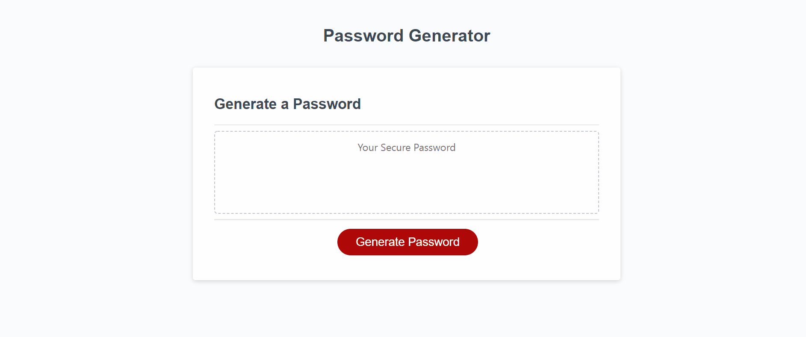

# Challenge 3: Password Generator Starter Code
 

## **Link** to web application: https://alinz07.github.io/friendly-parakeet/

## **Link** to project repository: https://github.com/alinz07/friendly-parakeet
 

## **Purpose**
The purpose of this project is to refactor a javascript file to randomly generate a password that meets the listed criteria in order to create a strong password that provides greater security for the mock employee.
 
 

## **Challenge Criteria**
AS AN employee with access to sensitive data
I WANT to randomly generate a password that meets certain criteria
SO THAT I can create a strong password that provides greater security

GIVEN I need a new, secure password  
* WHEN I click the button to generate a password 
THEN I am presented with a series of prompts for password criteria

* WHEN prompted for password criteria 
THEN I select which criteria to include in the password

* WHEN prompted for the length of the password 
THEN I choose a length of at least 8 characters and no more than 128 characters

* WHEN asked for character types to include in the password 
THEN I confirm whether or not to include lowercase, uppercase, numeric, and/or special characters

* WHEN I answer each prompt 
THEN my input should be validated and at least one character type should be selected

* WHEN all prompts are answered 
THEN a password is generated that matches the selected criteria

* WHEN the password is generated 
THEN the password is either displayed in an alert or written to the page
 
 

## **How and Why**
Within the given generatePassword() funciton I nested another function, criteriaTypes(). I initially did this so I could keep recalling the function to meet the acceptance criteria, that the user choose one of the four character types, but continually ran into issues. Because we are assigning the output of generatePassword() to the variable 'password', return statements will only work if it's the first time the script runs, otherwise, in this instance, undefined is assigned to 'password.' I had the same issue when I was trying to run criteriaTypes() and fixed it by using a whilel loop and putting the only return statement after the while loop executed and had a valid output.

Once I established the criteria with the criteriaTypes() functoin, and added at least one random character from one of the 4 types offered, I was able to finish the generatePassword() function by finding out how many more characters I needed, and using that total to set a limit of iterations of a for loop, which indexes items from a list containing the character types the user selected. These indexed characters are concatenated to the existing password from criteriaTypes and finally a value is returned and assigned to password in the writePassword() function.

I ran into another issue when concatenating lists to the options list so I could pull random characters from the options list to fulfill the password length using only character types approved by the user. The loop was indexing the commas in the options list. So I had to create another empty list, for loop iterating the same number of times as the length of the list, and only adding not commas to the new list. This list was used to index characters to fulfill the remainder of the password length.
 
 

## **Things I learned**
* What the .value property means and how documentQuery links it to html elements. At first I was confused how the writePassword() function was "returning" something in the form of a generated password.

* I learned that when you concatenate lists into one main list and then try to index it, the commas that separated the values of the original lists will have their own index.
 
 

## **What makes this project stand out?**
This project is special because of the user data validation. Users will know what to enter in the prompts and what the outcomes of their responses were with window.alerts.
 
 

# Screenshot of web application

 
 

### **Credits**
* The original code was provided by UW-Milwaukee Extended Campus Full-stack coding bootcamp.